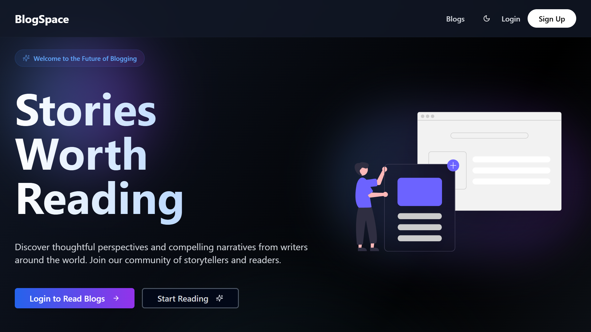
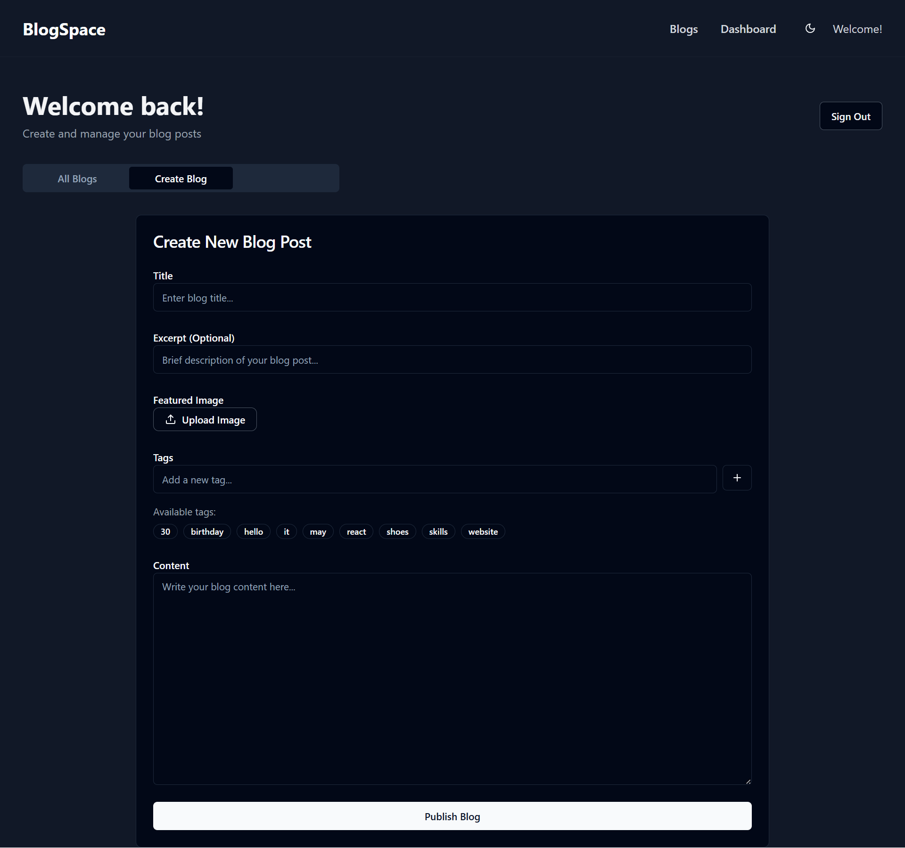

# 📘 BlogSpace

A **modern, full-stack blogging platform** built with performance and design in mind. BlogSpace allows users to create, update, and manage blogs with a seamless and interactive experience.

---

## 🚀 Features

- 🔐 **User Authentication** (Sign Up / Login / Logout)
- 📝 **Full CRUD** functionality (Create, Read, Update, Delete) for blog posts
- 🌙 **Toggle Dark / Light Mode**
- 🎨 **Accessible & Responsive UI** across devices
- ⚡ **Smooth animations** for UI elements

---

## 🛠️ Tech Stack

| Frontend        | Styling/UI                  | Animations             | Backend/Auth |
|-----------------|-----------------------------|-------------------------|---------------|
| Vite            | Tailwind CSS                | GSAP                    | Supabase      |
| React + TypeScript | shadcn/ui + Radix UI     | Framer Motion           |               |

---

## 📷 Screenshots




---

## How to Run Locally

1. **Clone the repo**
```bash
git clone https://github.com/your-username/blogspace.git
cd blogspace
```

2. **Install dependencies**
```npm install```

3. **Setup Supabase**

- Create a project on Supabase

- Get your anon key and project URL

- Create a .env file and add:
```
VITE_SUPABASE_URL=your_supabase_url
VITE_SUPABASE_ANON_KEY=your_anon_key
```
4. **Run the project**
```npm run dev```

---

🌐 Live Demo
👉 <a href="https://blogspacedotcom.vercel.app/" target="_blank">🌐 Live Demo</a>

👉 <a href="https://github.com/Rupa30/BlogSpace" target="_blank">🔖 GitHub Repo</a>

---